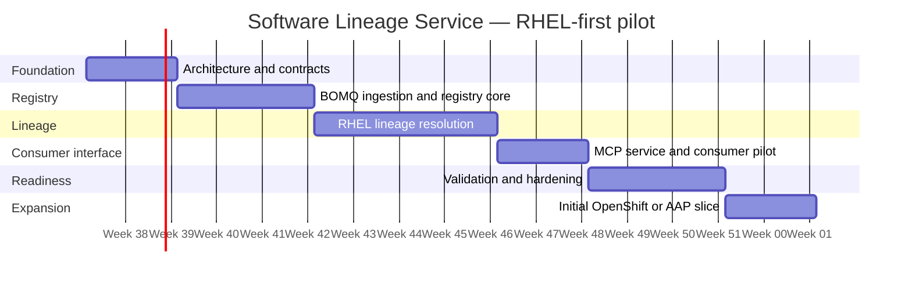

# Software Lineage Service: RHEL-First Pilot Timeline

## Executive timeline

An experienced senior or principal engineer, using AI assistance for the majority of implementation and test work, can deliver a validated RHEL-first pilot in **10–14 weeks**.

The phases above are sequential for planning clarity. In practice, MCP implementation and validation can begin during lineage-resolution work, making the overall pilot a 10–14 week effort rather than the 16-week sum of every upper-bound estimate.

## Phases and outcomes

| Phase | Timeline | Deliverables |
|---|---:|---|
| Architecture and contracts | Weeks 1–2 | Canonical identity and provenance model; evidence and confidence policy; BOMQ ingestion contract; MCP tool specification. |
| BOMQ ingestion and registry core | Weeks 3–5 | Immutable manifest snapshots; normalized components, artifacts, builds, and product occurrences; RHEL 9/10 data loaded. |
| RHEL lineage resolution | Weeks 6–9 | Brew/source linkage; exact source-equivalence resolution; reviewed renamed-component mapping workflow; upstream/downstream lineage queries. |
| MCP service and consumer pilot | Weeks 8–10 | Authenticated MCP server; component resolution, lineage, occurrence, comparison, and relationship-explanation tools. |
| Validation and hardening | Weeks 10–12 | Reviewed RHEL test corpus; coverage and accuracy measures; operational documentation; production-readiness fixes. |
| Initial expansion | Weeks 13–14 | One prioritized OpenShift or Ansible Automation Platform slice, validating that the data and connector model generalize beyond RHEL. |

## Milestones

| Milestone | Target | Demonstrable outcome |
|---|---:|---|
| Portfolio inventory query | Week 4 | Answer where a specific BOMQ component/artifact is shipped in RHEL. |
| Renamed-component proof of concept | Week 7 | Resolve a `django` / `python-django`-style relationship to a canonical upstream family with supporting source/build evidence. |
| MCP pilot | Week 10 | Selected consumers can query component identity, lineage, and product occurrences through MCP. |
| Validated RHEL pilot | Weeks 11–12 | Reviewed RHEL results meet the agreed accuracy and provenance-coverage thresholds. |
| Cross-portfolio proof | Weeks 13–14 | An OpenShift or AAP slice works without changing the fundamental registry model. |

## Assumptions and critical dependencies

- One dedicated, experienced senior or principal engineer.
- Read access to BOMQ, Brew/build provenance, Product Definitions, and the product metadata needed for RHEL validation.
- Named reviewers available to adjudicate ambiguous component-rename and fork relationships.
- AI assistance is used for connectors, schema and API implementation, test generation, MCP tooling, and documentation.

AI assistance reduces implementation time substantially. The schedule is more likely to be constrained by data quality, system access, and decisions about ambiguous lineage than by writing code.
